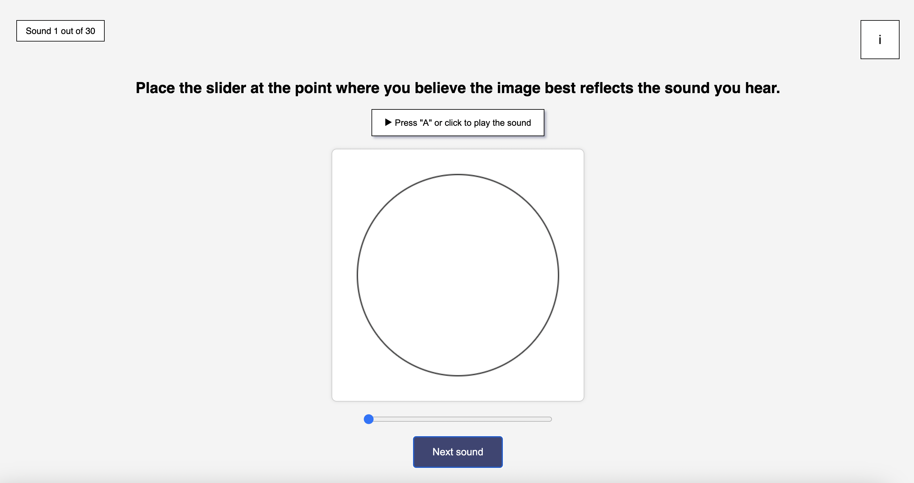
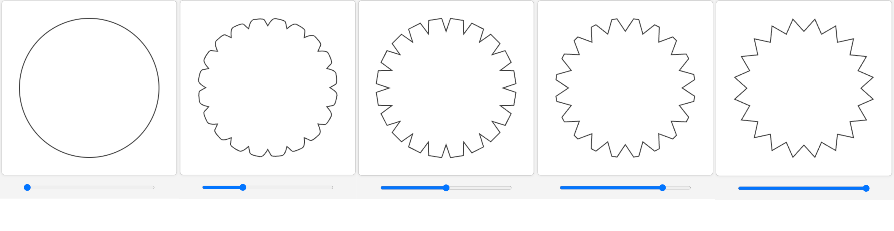

# 🎧🔵 Sound–Shape Crossmodal Correspondence Experiment

This repository contains the full implementation and audio material for an interactive web-based experiment exploring how people intuitively associate **sound textures** with **visual shape morphologies**.  

  

Participants listen to short sound clips and adjust a shape via a slider—from smooth to rough to sharp—based on how they perceive each sound.

  

---

## 📌 Overview

- **Research area**: Cross-modal perception, auditory-visual correspondences, sound texture
- **Method**: Browser-based interface using HTML5 + JavaScript + FastAPI (python)
- **Data collected**: Shape selection (slider value), demographic info (music experience, listening equipment)

